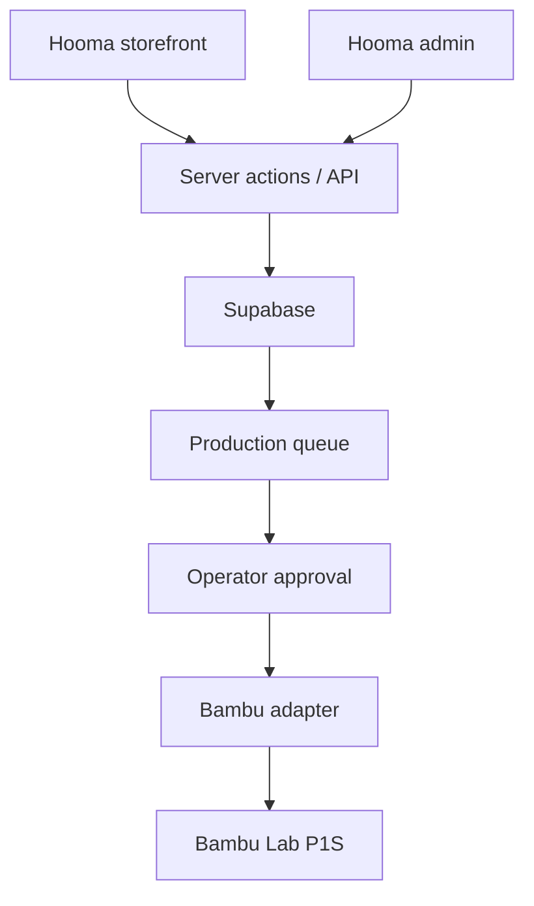

# Hooma Commerce V1

## Outcome

Build a Georgian-first online store where a customer finds a useful product by category, chooses an available variation, places a test order, and tracks it through production and delivery. Hooma's operator manages catalog, licensing, production, quality control, and fulfillment from one admin panel.

## Customer flow

1. Browse category and subcategory.
2. Open a product and choose variation, material, and color.
3. Add to cart and submit a test order.
4. Receive an order number and tracking link.
5. Follow customer-friendly order events until delivery.

## Admin flow

1. Create a product manually or paste a MakerWorld source URL into the import inbox.
2. Review title, creator, source ID, commercial license, media rights, print profile, plates, material, print time, and cost.
3. Assign category and subcategory, write Hooma copy, set variants and price.
4. Publish only after license and production checks pass.
5. Confirm an order and approve production.
6. Assign jobs to a printer, monitor progress, record quality control, and hand off for delivery.

## V1 category tree

| Category | Subcategories |
| --- | --- |
| 3D პრინტერი | 3D პრინტერის აქსესუარები; 3D პრინტერის ნაწილები; სატესტო მოდელები |
| ხელოვნება | 2D ხელოვნება; მონეტები და სამკერდე ნიშნები; ნიშნები და ლოგოები; ქანდაკებები; სხვა ხელოვნების მოდელები |
| განათლება | ბიოლოგია; ქიმია; ინჟინერია; გეოგრაფია; მათემატიკა; ფიზიკა და ასტრონომია; სხვა საგანმანათლებლო მოდელები |
| მოდა | ჩანთები; ტანსაცმელი; საყურეები; ფეხსაცმელი; სათვალე; სამკაულები; ბეჭდები; სხვა მოდის მოდელები |
| ჰობი და საკუთარი ხელით კეთება | ელექტრონიკა; მუსიკა; RC; რობოტიკა; სპორტი და ღია ცის ქვეშ; მანქანები; სხვა ჰობი და საკუთარი ხელით კეთების მოდელები |
| საყოფაცხოვრებო | დეკორი; დღესასწაულები; ბაღი; ოფისი; შინაური ცხოველები; სხვა სახლის მოდელები |
| მინიატურები | ცხოველები; არქიტექტურა; არსებები; ხალხი; სხვა მინიატურები |
| რეკვიზიტები და კოსფლეი | კოსტიუმები; ნიღბები და ჩაფხუტები; კოსფლეის იარაღები; სხვა რეკვიზიტები და კოსფლეი |
| ხელსაწყოები | გაჯეტები; ხელის ხელსაწყოები; ჩარჩოები; საზომი ინსტრუმენტები; სამედიცინო ინსტრუმენტები; ორგანიზატორები; სხვა ინსტრუმენტები |
| სათამაშოები და თამაშები | სამაგიდო თამაშები; პერსონაჟები; გარე სათამაშოები; თავსატეხები; სამშენებლო ნაკრებები; სხვა სათამაშოები და თამაშები |
| გენერაციული 3D მოდელი | — |

ინდივიდუალური შეკვეთა კატალოგისგან განცალკევებული ავტორიზებული workflow-ია და საჯარო კატეგორიად არ ჩანს.

## System boundaries

## Automation stages

### Stage 1 — operator-led

- Manual product entry and source review
- Test checkout, no bank API
- Operator confirms and starts print
- Manual tracking events

### Stage 2 — assisted automation

- Metadata draft from a submitted source URL
- Automatic cost and capacity estimate
- Suggested category, copy, and price
- Prepared Bambu print job requiring one operator approval

### Stage 3 — controlled automation

- Signed bank webhooks
- Automatic production reservation after verified payment
- Printer selection and plate scheduling
- Live status and customer notifications

## Security baseline

- Supabase RLS on every public table
- Admin role checked server-side
- Server-authoritative pricing and totals
- Immutable payment and order event records
- Signed, idempotent payment webhooks
- Printer credentials restricted to server-only adapter
- Audit log for product publication, order status, refunds, and printer actions
- Storage buckets separated into public catalog media and private source/production files
- Rate limits and bot protection before public checkout launch

## Deliberately deferred

- Live TBC/Bank of Georgia integration
- Fully automatic MakerWorld ingestion
- Automatic print start without operator approval
- Customer-visible printer camera stream
- Production pricing until print-time, material, failure allowance, packaging, and delivery costs are validated
